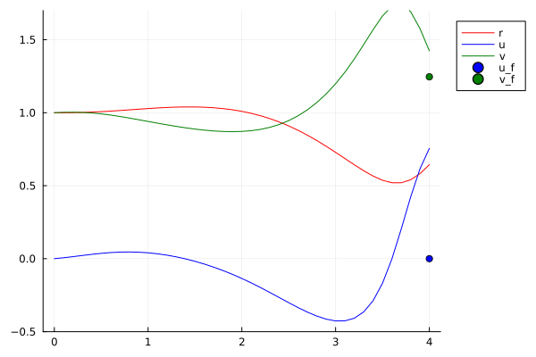
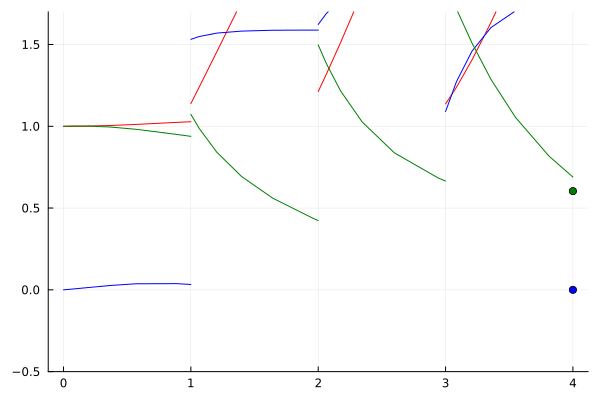
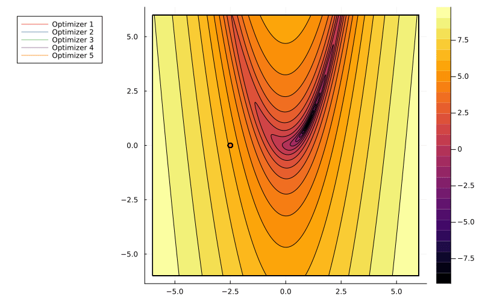
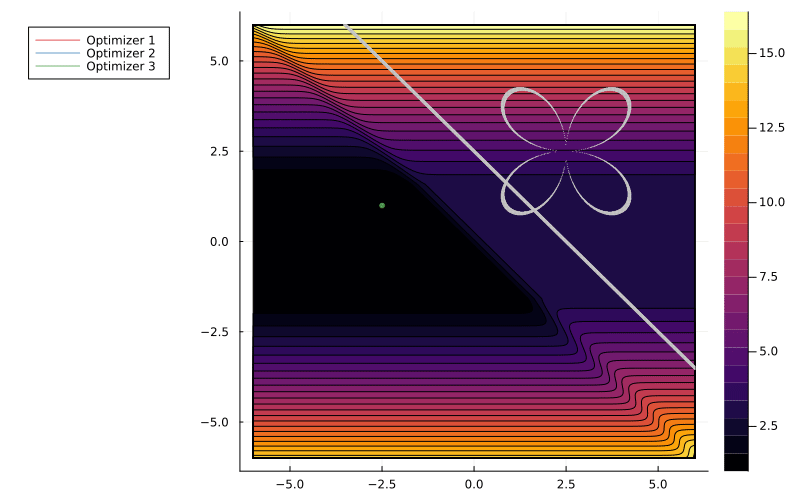
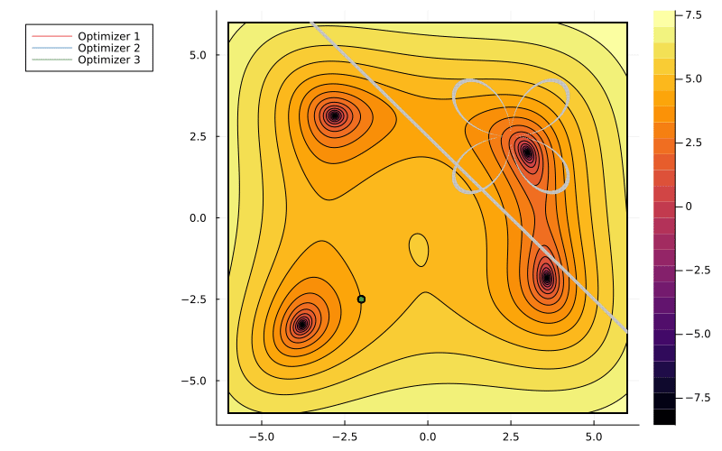
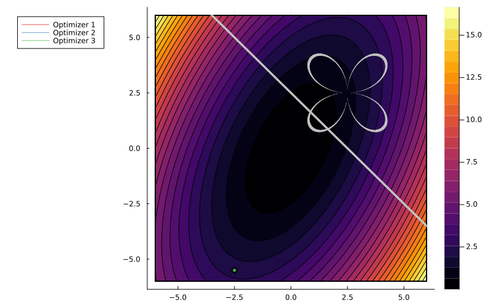
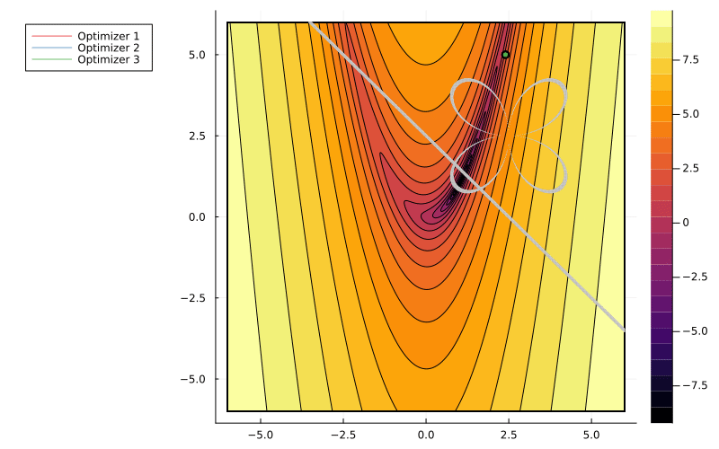

# OptimizationDemo

## Shooting On Orbit Problem

  

## Multi-Shooting on Orbit Problem with 3 Intermediate Points

  

## Multi-Shooting on Orbit Problem with 8 Intermediate Points

  

## Brachistrochrone

  

## Unconstrained Optimization

  

## Flat Valley with Equality Constraints

  

## Rosenbrock with Equality Constraints

  

## Beale with Equality Constraints

  

## Ellipse with Equality Constraints

  

## Rosenbrock with Inequality Constraints

  

## Rosenbrock with Inequality and Equality Constraints

  

